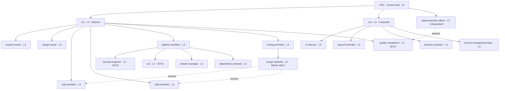

# Organisation — RU-AIBOTWORKS

<!-- GENERATED by PLATFORM/ru_aibotworks_charter.py from the registry.
     Do not hand-edit. Change REGISTRY and regenerate. -->

**19 officers · 259 workforce · 278 agents ·
3 standing vetoes · 3 divisions · 19 departments ·
49 teams · deepest chain 5**

## The chart

`merge-authority` reports to `testing-architect`, **not** to the architects it
reviews. That edge is why verification cannot be overruled by the team it verifies.

`data-protection-officer` reports to the CEO directly, because GDPR Art. 38(3)
requires the DPO to reach the highest management level and to take no instruction on
how to perform the role.

## The 19 officers

| Officer | Name | Level | Reports to | Function | Decides | Model | Power | Added |
|---|---|---|---|---|---|---|---|---|
| `cto` | Aarav | L4 | `CEO` | Direct | Triage size, dispatch, off-stack proposals | inherit | — | original |
| `coo` | Aditya | L4 | `CEO` | Corporate | Corporate service direction, department budgets, workforce policy | inherit | — | ADR-002 |
| `product-owner` | Arjun | L3 | `cto` | Direct | Success criteria, scope, the Requirements gate | sonnet | — | original |
| `design-owner` | Ayaan | L3 | `cto` | Direct | DESIGN.md, aesthetic family, the Design gate | inherit | — | original |
| `web-architect` | Advik | L3 | `cto` | Build | Lane choice (A/B/C1/C2/C3), component structure, API shape | opus | — | original |
| `data-architect` | Akash | L3 | `cto` | Build | Schema, grain, retention, service contracts | opus | — | original |
| `platform-architect` | Amit | L3 | `cto` | Build | CI shape, environments, Cedar policy, plugin architecture | opus | — | original |
| `testing-architect` | Ajay | L3 | `cto` | Verify | Quality bar, gate contents, blocking vs advisory | sonnet | — | original |
| `quality-compliance` | Alok | L3 | `cto` | Verify | Documented non-conformance blocks the release | opus | VETO | original |
| `merge-authority` | Ashwin | L2 | `testing-architect` | Verify | Whether this merges | opus | READ-ONLY | original |
| `security-engineer` | Anil | L2 | `platform-architect` | Verify | Vulnerabilities, receipt-chain verification | opus | VETO | original |
| `sre` | Ansh | L2 | `platform-architect` | Ship | Production instability blocks the release | opus | VETO | original |
| `release-manager` | Aryan | L2 | `platform-architect` | Ship | Promotion and failure routing | sonnet | — | original |
| `dependency-steward` | Atharv | L2 | `platform-architect` | Ship | Pins, certification records, fork log, Tier C teardown | sonnet | — | original |
| `hr-director` | Aanya | L3 | `coo` | Corporate | Agent registration, onboarding, the autonomy ladder, decommission | sonnet | — | ADR-002 |
| `payroll-controller` | Aadhya | L3 | `coo` | Corporate | Token and agent-hour metering, rate cards, period close | sonnet | — | ADR-002 |
| `finance-controller` | Anika | L3 | `coo` | Corporate | Budgets, cost governance, unit economics, client billing | sonnet | — | ADR-002 |
| `service-management-lead` | Ananya | L3 | `coo` | Corporate | Service catalogue, SLAs, incident/problem/change governance | sonnet | — | ADR-002 |
| `data-protection-officer` | Anjali | L3 | `CEO` | Privacy | GDPR and HIPAA assessment, DPIA, breach clocks, records of processing | opus | — | ADR-002 |

2 at L4, 12 at L3, 5 at L2, one human L5.

## Vetoes

Exactly 3, and the count is enforced on every build.

| Holder | Blocks on | Override |
|---|---|---|
| `quality-compliance` (Alok) | Documented non-conformance blocks the release | CEO only |
| `security-engineer` (Anil) | Vulnerabilities, receipt-chain verification | CEO only |
| `sre` (Ansh) | Production instability blocks the release | CEO only |

Neither `cto` nor `coo` can override any of them. An autonomous chief *is* delivery
pressure and must not reach its own stop buttons.

The Data Protection Officer holds **no veto**. It raises findings;
`quality-compliance` blocks on them. Under GDPR the DPO advises, monitors and
reports — it does not hold an operational stop button.

## The 19 departments

| Department | Division | Officer | Teams | Staff | Mission |
|---|---|---|---|---|---|
| Office of the CTO | Delivery | `cto` | 2 | 8 | Triage incoming work, sequence delivery, and keep orchestration out of the entry point. |
| Product | Delivery | `product-owner` | 3 | 20 | Decide what done means, and prove it can be falsified. |
| Design | Delivery | `design-owner` | 3 | 10 | Ten templates that do not look like siblings. |
| Web Engineering | Delivery | `web-architect` | 4 | 52 | Build Lane A and Lane B to a structure someone else decided. |
| Mobile Engineering | Delivery | `web-architect` | 4 | 17 | Lane C. Three stacks, one per project, never two. |
| Data & AI | Delivery | `data-architect` | 3 | 26 | Schema, grain and retention decided before the data exists. |
| Platform Engineering | Delivery | `platform-architect` | 3 | 17 | Make the compliant path the easy path, and make platform controls fail closed. |
| Quality Engineering | Delivery | `testing-architect` | 2 | 11 | Set the bar, and never make a flaky check blocking. |
| Code Review | Delivery | `merge-authority` | 1 | 7 | Verification that reports outside the team it verifies. |
| Security | Delivery | `security-engineer` | 2 | 9 | Assume injection succeeds; bound what a hijacked agent can reach. |
| Compliance & Governance | Delivery | `quality-compliance` | 2 | 8 | Documented non-conformance blocks the release. |
| Release Engineering | Delivery | `release-manager` | 2 | 14 | Promote what is green; route what is not; fix nothing. |
| Site Reliability | Delivery | `sre` | 2 | 10 | Keep it up, and stop anything that would not stay up. |
| Supply Chain | Delivery | `dependency-steward` | 1 | 10 | Everything pinned, certified, logged, and torn down after. |
| Human Resources | Corporate | `hr-director` | 3 | 8 | The workforce is agents. Hire them, train them, promote them, retire them — on the record. |
| Payroll | Corporate | `payroll-controller` | 2 | 6 | An AI company's payroll is tokens and wall clock. Meter it, reconcile it, close it. |
| Finance | Corporate | `finance-controller` | 3 | 8 | Know the unit economics of every template, and make budgets that halt rather than warn. |
| Service Management | Corporate | `service-management-lead` | 4 | 10 | The service layer between clients and delivery. Catalogue, SLA, incident, problem, change. |
| Data Protection Office | Independent | `data-protection-officer` | 3 | 8 | Advise, monitor and report on data protection. Independent of every function assessed. |

## Team leads

49 teams, 49 leads. 41 hold **L2** by
deliberate, logged promotion — an officer's request, a written reason and a date.
The other 8 stay at **L1** because their department's
officer is itself L2: there is no room above them, and an L2 reporting to an L2
inverts authority. Those departments are flat, and the lead coordinates without a
reporting line beneath it.

Generated 2026-09-14.
