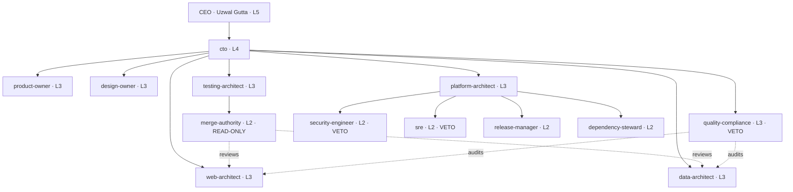

# Organisation — RU AI Botworks

<!-- Figures derive from scripts/company.py. Do not hand-edit numbers. -->

**13 officers · 202 engineers · 215 agents total ·
3 vetoes · 4 functions · deepest chain 3**

## The chart

`merge-authority` reports to `testing-architect`, **not** to the architects it
reviews. That edge is why verification cannot be overruled by the team it
verifies.

## The 13 officers

| Officer | Level | Reports to | Function | Decides | Model | Power |
|---|---|---|---|---|---|---|
| `cto` | L4 | CEO | Direct | Triage size, dispatch, off-stack proposals | inherit | — |
| `product-owner` | L3 | cto | Direct | Success criteria, scope, the Requirements gate | sonnet | — |
| `design-owner` | L3 | cto | Direct | DESIGN.md, aesthetic family, the Design gate | inherit | — |
| `web-architect` | L3 | cto | Build | Lane A/B choice, component structure, API shape | opus | — |
| `data-architect` | L3 | cto | Build | Schema, grain, retention, service contracts | opus | — |
| `platform-architect` | L3 | cto | Build | CI shape, environments, Cedar policy, plugin architecture | opus | — |
| `testing-architect` | L3 | cto | Verify | Quality bar, gate contents, blocking vs advisory | sonnet | — |
| `quality-compliance` | L3 | cto | Verify | Documented non-conformance blocks the release | opus | VETO |
| `merge-authority` | L2 | testing-architect | Verify | Whether this merges. Holds no Write or Edit | opus | READ-ONLY |
| `security-engineer` | L2 | platform-architect | Verify | Vulnerabilities, receipt-chain verification, /audit | opus | VETO |
| `sre` | L2 | platform-architect | Ship | Production instability blocks the release | opus | VETO |
| `release-manager` | L2 | platform-architect | Ship | Promotion and failure routing. Routes, never fixes | sonnet | — |
| `dependency-steward` | L2 | platform-architect | Ship | Fork log, pins, certification, Tier C teardown | sonnet | — |

7 at L3, 5 at L2, one L4, one human L5.

## Vetoes

| Holder | Blocks on | Override |
|---|---|---|
| `security-engineer` | Unresolved vulnerability; broken receipt chain | CEO only |
| `sre` | Production instability | CEO only |
| `quality-compliance` | Documented non-conformance | CEO only |

The `cto` agent cannot override any of them. An autonomous CTO *is* delivery
pressure and must not reach its own stop buttons.

## Plugin ownership

All 94 plugins map to exactly one officer, which is what makes placement
of all 202 engineers deterministic. An unmapped plugin **fails the build**.

| Officer | Function | Plugins owned |
|---|---|---|
| `web-architect` | Build | 22 |
| `data-architect` | Build | 12 |
| `product-owner` | Direct | 10 |
| `platform-architect` | Build | 9 |
| `release-manager` | Ship | 8 |
| `testing-architect` | Verify | 6 |
| `sre` | Ship | 4 |
| `design-owner` | Direct | 4 |
| `security-engineer` | Verify | 4 |
| `quality-compliance` | Verify | 4 |
| `dependency-steward` | Ship | 4 |
| `cto` | Direct | 4 |
| `merge-authority` | Verify | 3 |

## Outside the fork

One capability is owned but not part of the 94. It is pinned, certified and
licence-checked separately.

| Component | Owner | Source | Note |
|---|---|---|---|
| `ui-ux-pro-max` | `design-owner` | `nextlevelbuilder/ui-ux-pro-max-skill` | Second ecosystem. Licence unverified — `web-compliance-engineer` clears it |

## Declined domains

Held in the fork, governed, never dispatched. Recorded rather than deleted so the
fork stays mergeable.

- `arm-cortex-microcontrollers`
- `blockchain-web3`
- `game-development`
- `quantitative-trading`
- `reverse-engineering`

## Model tiers

| Tier | Model | Officers |
|---|---|---|
| 1 | Opus | `merge-authority`, `security-engineer`, `sre`, `quality-compliance`, all three architects |
| 2 | inherit | `cto`, `design-owner` |
| 3 | Sonnet | `product-owner`, `testing-architect`, `release-manager`, `dependency-steward` |
| 0 | Fable | Opt-in only. ~2.6x Opus cost. Never for security agents |

Reviewers and vetoes run on the strongest tier. The decisions that stop a release
are the wrong place to economise.

<!-- MANUAL:START id=org-notes -->
Roster changes and what forced them.
<!-- MANUAL:END id=org-notes -->
