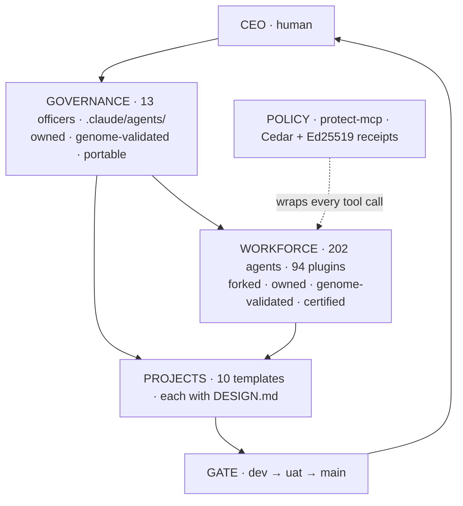

# Architecture and technical specification

<!-- Hand-authored. Never generated. -->

## Layers



Policy does not sit above the workforce in the chart. It wraps **every tool call
the workforce makes** and leaves a signed receipt. That is the difference between
a rule and an enforcement.

---

## File layout

```
repo/
├── .claude/
│   ├── agents/                13 officers. The decision layer
│   ├── standards/
│   │   ├── company/           L1 — read by every officer
│   │   └── functions/         L2 — Direct, Build, Verify, Ship
│   ├── plugins/               THE FORK — ruai-botworks/agents. 202 owned agents
│   ├── policy/cedar/          written from observed receipts
│   └── commands/              build · rerun · audit · hire
├── scripts/
│   ├── genome.py              11 invariants over 12 files
│   ├── check_links.py
│   └── docgen/generate.py     runs inside the gate
├── projects/
│   ├── _shared/               the reuse ladder
│   └── <ten templates>/       each with DESIGN.md
├── plugins.lock.toml          THE PIN FILE
└── docs/charter/              this set — never generated
```

---

## The fork log

```toml
# fork.toml — this company's tree and every divergence in it.

[fork]
origin    = "wshobson/agents"       # MIT. Attribution retained in LICENSE
ours      = "ruai-botworks/agents"          # THE SOURCE OF TRUTH
forked_at = "<commit-sha>"
last_merge = "<commit-sha>"         # reviewed monthly, never automatic
owner     = "dependency-steward"

[governance]
# Applied to all 202 inherited agents. Keys upstream does not use,
# so merges stay clean. This is what makes them governable.
default_decision_level = "L1"
default_reports_to     = "<owning officer, per dispatch map>"

[promotions]                        # deliberate acts only, logged
# "agent-name" = { level = "L2", reason = "...", date = "..." }

[divergences]                       # every rewritten agent body
# "agent-name" = { reason = "...", date = "...", maintained_by = "us" }

[external]                          # NOT covered by the main MIT grant
qa-orchestra   = { licence = "<verify>", pin = "<sha>", gate = "blocking" }
ciagent        = { licence = "<verify>", pin = "<sha>", gate = "advisory" }
storymap-skill = { licence = "<verify>", pin = "<sha>", gate = "none" }
pensyve        = { licence = "<verify>", pin = "<sha>", gate = "none" }
hol-guard      = { licence = "<verify>", pin = "43b2dda", note = "modifies hook/settings config" }

[policy]
mode = "audit"    # receipts on, enforcement off, until one full build is observed
```

## Install tiers

```toml
# tiers.toml — which of the 94 plugins are active, and when.

[tier_a]   # always installed — 10
plugins = ["python-development", "javascript-typescript",
           "frontend-mobile-development", "backend-development",
           "database-design", "unit-testing", "comprehensive-review",
           "accessibility-compliance", "security-scanning", "git-pr-workflows"]

[tier_b]   # governance — always installed — 5
plugins = ["protect-mcp", "review-agent-governance", "block-no-verify",
           "plugin-eval", "dependency-management"]

[tier_c]   # per project — UNINSTALL AFTER
plugins = ["payment-processing", "security-compliance", "database-migrations",
           "data-engineering", "data-validation-suite", "qa-orchestra",
           "ciagent", "seo-technical-optimization", "ui-design",
           "brand-landingpage", "multi-platform-apps", "cicd-automation",
           "deployment-validation", "storymap-skill", "before-you-build"]
```

Owning the tree does not mean loading all of it. Each installed plugin loads only
its own components, so Tier C discipline is still what keeps the context baseline
honest.


---

## The thirteen invariants

Enforced by `genome.py` on every run, now across **all 215 agents** rather than
twelve. This is the capability the fork unlocks: upstream agents carry no
`reports_to` and no `decision_level`, so while the tree was external it could not
be validated. Owned, it can be extended — and what can be extended can be
governed.

1. Every reporting line resolves to an agent that exists — **all 215**.
2. Authority never inverts across a reporting line.
3. Exactly three standing vetoes, held by the same officers.
4. The reserved-decision list has not shrunk.
5. **Every agent in the fork carries `reports_to` and `decision_level`.** No
   ungoverned agent runs here.
6. **No agent in the fork holds `decision_level` above L1** unless an officer
   promoted it deliberately and the promotion is logged.
7. Every plugin carries a current `plugin-eval` certification against its
   fork commit.
8. **No orchestrator is reachable from `/build`.**
9. No agent holds both a veto and `Write` on a project it can block.
10. Every project has a `DESIGN.md`.
11. Any figure appearing in two generated documents derives from one computed
    source. *(Added after the same defect was found in both this company's docs
    and the upstream tree's.)*
12. **Every divergence from upstream is recorded in the fork log** with a reason.
    Undocumented drift is indistinguishable from an accident.
13. **Exactly one design generator is active per build.** The project's
    `DESIGN.md` names it; the gate fails if a second is installed during that
    build. Owning several is fine and deliberate — two active in one session
    give the agent contradictory style instructions.

Invariants 5 and 6 are the ones that matter most. Two hundred and two capable
agents with no declared authority is not a workforce — it is 202 agents that
might each think they can decide something. Declaring every one of them L1 by
default, and promoting only by deliberate act, is what turns a toolbox into an
organisation.

---

## Gate

| Family | Runs | Blocks |
|---|---|---|
| Project tests — Lane A | `pip check`, `pip-audit`, `mypy`, `pytest` | yes |
| Project tests — Lane B | `npm audit`, `tsc --noEmit`, `vitest` | yes |
| Repository | `mypy scripts/`, repo suite, `genome.py --validate`, `check_links.py` | yes |
| Links | `lychee` — internal **and** external | yes |
| Diagrams | `mmdc --parse-only` over every Mermaid block | yes |
| Plugin integrity | pins match lock file; certifications current | yes |
| Policy receipts | `protect-mcp` chain verifies offline | yes |
| E2E | `qa-orchestra` + Playwright, isolated profile | yes |
| Agent regression | `ciagent` golden-trace | **advisory** |

Promotion depends on job **success**, not a pass percentage. A cancelled,
timed-out, or unscheduled job is a failure. No failure-percentage allowance. No
skipped tests.

Every job is deterministic and runs in CI, so the gate costs zero context tokens.

---

## Context economics

Adding the marketplace loads nothing. Each installed plugin loads **only its own
components**. Average plugin is 3.6 components, following Anthropic's 2–8
pattern. The 183 skills use progressive disclosure — they load on activation, not
on install.

| Item | Est. tokens/session |
|---|---|
| Tier A — 10 plugins | ~2.5–4K |
| Tier B — 5 plugins | ~1–1.5K |
| Tier C — 5–8, project-scoped | ~1.5–2.5K |
| 12 officer descriptions | ~0.6K |
| **Baseline** | **~5.5–8.5K** |

The number stays honest only if Tier C comes out between projects. That is
`dependency-steward`'s standing duty and the most commonly skipped step in any
agent stack.

---

## Failure isolation

| Fails | Symptom | Response |
|---|---|---|
| Officer file malformed | Gate fails, nothing promotes | Correct — genome over 12 files |
| Cedar policy too strict | Agents stall | Loosen **from receipts**, never under deadline |
| Cedar policy too permissive | Ceremony without protection | Receipts are auditable. Read them |
| Plugin drifts on pin bump | Behaviour changes silently | `ciagent` golden-trace, advisory |
| Upstream repo disappears | Nothing | Vendored copy. MIT |
| Maintainer stops | Workforce frozen at pin | Repoint 13 officers at another marketplace |
| `pensyve` memory down | Cold context, slower | No gate dependency |

---

## Prerequisites

| Requirement | Needed by |
|---|---|
| Claude Code 2.1+ | plugin marketplace |
| Node.js 18+ | Playwright, mermaid-cli, `block-no-verify` hook |
| Python 3.12+ | `python-development`, `plugin-eval` |
| `uv` | `plugin-eval score` / `certify` |
| Git, `gh` | plugin install |

**Hard limit:** iOS cannot build on Windows — Xcode is macOS-only.
`multi-platform-apps` coordinates iOS work but cannot compile it. State this to
clients rather than letting them discover it.

<!-- MANUAL:START id=arch-notes -->
Architecture decisions and their falsifiers.
<!-- MANUAL:END id=arch-notes -->
