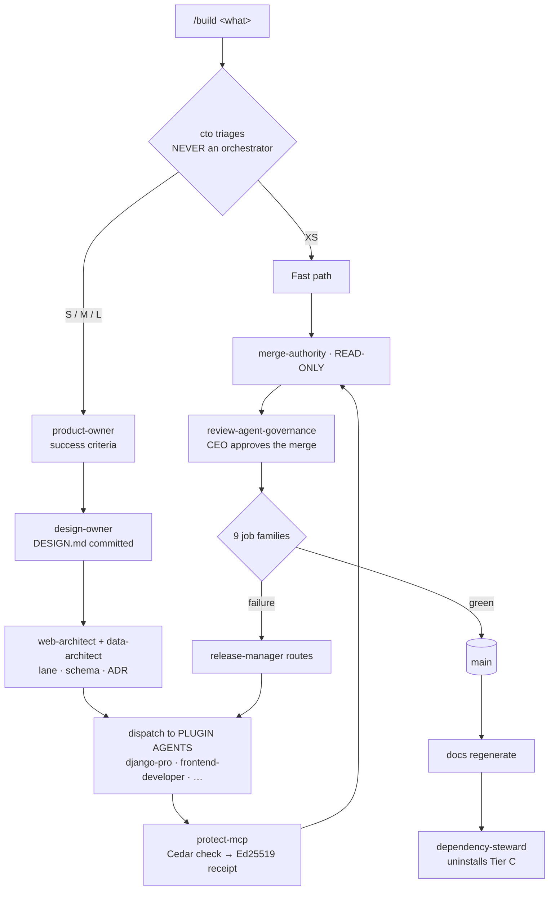

# Workflow

<!-- Hand-authored. Never generated. -->

## End to end



Three boxes carry the design. `cto` at the top keeps an orchestrator from
becoming the entry point. `protect-mcp` in the middle means every action any of
the 215 takes leaves a receipt. `CLEAN` at the bottom is the step everyone skips.

---

## Phases

| Phase | Owner | Cannot exit until | Workforce used |
|---|---|---|---|
| Triage | `cto` | Size decided: XS / S / M / L | — |
| Requirements | `product-owner` | Success criteria written | `storymap-skill` |
| **Design** | `design-owner` | `DESIGN.md` committed **and CEO-approved** | `ui-design`, `brand-landingpage` |
| Architecture | `web-architect`, `data-architect` | Lane chosen, schema set, ADR written | `database-design`, `backend-development` |
| Build | Architects dispatch | Compiles, tests pass | Tier A + C, orchestrators |
| Verify | `merge-authority`, then CEO | Reviewer approves; CEO signs the merge | `comprehensive-review`, `qa-orchestra` |
| Ship | `release-manager` | Every gate check clean | `deployment-validation` |
| Document | `cto` triggers docgen | Docs regenerate from what shipped | `documentation-generation` |
| **Teardown** | `dependency-steward` | Tier C uninstalled, context at baseline | — |

Design is gated because it is the only defence against ten sibling websites, and
it is the one gate the CEO personally clears.

---

## Dispatch — the mechanic that replaces seventy contributors

```
web-architect (owned, L3)
  decides    Lane A — Django + React
  invokes    django-pro           [plugin: python-development]
             frontend-developer   [plugin: frontend-mobile-development]
  each call  → protect-mcp → Cedar check → Ed25519 receipt → hash chain
  returns    a candidate, not a merge
  → merge-authority (owned, READ-ONLY) reviews
  → review-agent-governance requires CEO approval before merge
```

The architect holds the decision; the implementer holds the labour. Both are
owned, both are governed, and the receipt proves what happened. **No agent ever
merges its own work** — not because of where it came from, but because of what
it is.

---

## Triage

| Size | Signal | Path |
|---|---|---|
| XS | Copy, config, one file | One plugin agent → `merge-authority` → gate |
| S | One feature, one lane | Skip Architecture; Design only if UI changes |
| M | Multi-lane feature | Full lifecycle, parallel dispatch |
| L | New template | Full lifecycle + `DESIGN.md` + Tier C install |

Triage is L4 and belongs to `cto` alone. Under-sizing work is the cheapest way to
route around review, so this is the one place to be suspicious of your own
convenience.

---

## Failure routing

`release-manager` routes. It does not fix.

| Failure | Goes to |
|---|---|
| Test failure | `testing-architect` |
| Type error | Owning architect |
| `pip-audit` / SAST finding | `security-engineer` *(veto)* |
| Broken link, Mermaid parse failure | `cto` → docgen |
| Pin drift, uncertified plugin | `dependency-steward` |
| Policy receipt chain broken | `security-engineer` *(veto)* |
| Cedar policy blocking legitimate work | `platform-architect` — loosen from receipts |
| Gate job misconfigured | `platform-architect` |
| `qa-orchestra` E2E failure | `testing-architect` |
| `ciagent` golden-trace flip | `dependency-steward` — **advisory, never blocks** |
| Missing or stale `DESIGN.md` | `design-owner` |
| Production instability | `sre` *(veto)* |
| Documented non-conformance | `quality-compliance` *(veto)* |

---

## Commands

| Command | Owner | Does |
|---|---|---|
| `/build <what>` | `cto` | Triage, then dispatch. **The only entry point** |
| `/rerun` | `release-manager` | Re-run the gate |
| `/audit` | `security-engineer` | Verify the receipt chain; scan configs |
| `/hire <plugin>` | `dependency-steward` | Install, certify, record pin — **PR only** |

`/hire` no longer writes an agent. It adopts a plugin. That is the whole company
in one command.

---

## Escalation

Three paths reach the CEO directly, because the normal path would route the
decision to someone with an interest in the outcome.

1. **A veto is raised.** Only the CEO overrides.
2. **`merge-authority` versus an architect.** The reviewer reports to
   `testing-architect`, not into Build, so this cannot be settled inside Build.
3. **Off-stack technology.** A client mandating Java means installing
   `jvm-languages` — `cto` proposes, CEO approves.

---

## A normal day

```
09:00  /build "restaurant site for Client X — menu, reservations, gallery"
09:01  cto            size L. Lane B — content-heavy, CWV-critical
09:03  dep-steward    installs Tier C: ui-design, brand-landingpage,
                      seo-technical-optimization, qa-orchestra. Certs current
09:10  product-owner  success criteria written
09:25  design-owner   aesthetic family chosen, DESIGN.md committed
09:30  CEO            approves DESIGN.md          ← your first decision
09:35  web-architect  dispatches frontend-developer + seo agents
                      every tool call → Cedar → signed receipt
11:15  merge-authority  blocks: missing error path on the reservation form
11:40                 fixed
11:42  CEO            approves the merge           ← your second decision
11:45                 push to uat. Nine families run
11:52  lychee         two dead external links
       qa-orchestra   CWV budget breached on the hero image
12:20                 both fixed. Green. Promoted. Docs regenerate
12:25  dep-steward    uninstalls Tier C. Context back to baseline
```

Two decisions from you in a full template build. That is the target shape.

<!-- MANUAL:START id=workflow-notes -->
Observed timings and real bottlenecks.
<!-- MANUAL:END id=workflow-notes -->
