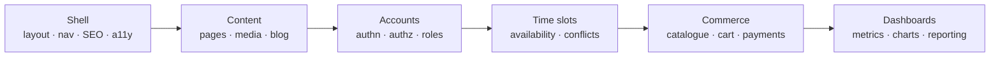

# Project catalogue

<!-- Hand-authored. Never generated. -->

## Two lanes

Chosen per template by `web-architect`. Not one stack, not a debate — a decision
made per job.

| | **Lane A** | **Lane B** |
|---|---|---|
| Stack | Django + React | Astro / Next, TypeScript only |
| For | Accounts, roles, admin, real data | Content, marketing, speed |
| Wins | Free admin, ORM, migrations | Best Core Web Vitals, one language |
| Plugins | `python-development`, `database-design` | `javascript-typescript`, `frontend-mobile-development` |
| Gate | `pip check`, `pip-audit`, `mypy`, `pytest` | `npm audit`, `tsc --noEmit`, `vitest` |

Java is **not** a lane. It is an off-stack L4 call triggered only by client
mandate, served by `jvm-languages` — one `/hire`, no new architecture.

---

## Build order

| # | Template | Lane | Complexity | Reuses | Tier C |
|---|---|---|---|---|---|
| 1 | **School** | A | ●●●○○ | — | `database-migrations`, `qa-orchestra` |
| 2 | **Corporate** | A | ●●○○○ | 1 | `seo-technical-optimization` |
| 3 | **Portfolio** | B | ●○○○○ | 2 | `ui-design`, `brand-landingpage` |
| 4 | **Restaurant** | B | ●●○○○ | 2, 3 | `seo-technical-optimization`, `qa-orchestra` |
| 5 | **Booking** | A | ●●●○○ | 1 | `database-migrations`, `data-validation-suite` |
| 6 | **Healthcare** | A | ●●●●○ | 1, 5 | `security-compliance`, `accessibility-compliance` |
| 7 | **E-commerce** | A | ●●●●○ | 2, 5 | `payment-processing`, `data-engineering` |
| 8 | **LMS** | A | ●●●●○ | 1, 5 | `database-migrations`, `data-engineering` |
| 9 | **SaaS dashboard** | A | ●●●●○ | 5, 7 | `data-engineering`, `data-validation-suite` |
| 10 | **CRM** | A | ●●●●● | 7, 9 | `business-analytics`, `customer-sales-automation` |

**Booking is fifth and that ordering is load-bearing.** Healthcare, E-commerce
and LMS all need the same time-slot engine — availability, conflicts,
cancellation, reminders. Build it once as a template and three downstream builds
inherit it. Build it late and you write it three times.

**Portfolio is third because it is a rest.** After two heavy builds you want one
that exercises the design pipeline without database complexity. It is the
cheapest place to prove `DESIGN.md` works.

**Restaurant is Lane B.** It is the template most likely to die on Core Web
Vitals — heavy imagery, no accounts — and static-first starts from a far better
baseline. This also gives Lane B three templates before anything critical depends
on it.

---

## Per template

### 1. School — Lane A
**Scope: hybrid.** Informational to production first; portal second. A portal is
an authn/authz and data-protection project wearing a website costume, and that is
not where you learn your own pipeline.
**Watch:** minors' data. `quality-compliance` engaged at design time.

### 2. Corporate — Lane A
Pages, team, careers, contact, blog. Proves template reuse.
**Watch:** the careers section is a hidden file-upload and form-handling project.

### 3. Portfolio — Lane B
The design proving ground. No database.
**Watch:** if Portfolio and Corporate look like siblings, `DESIGN.md` is not
working. `design-owner`'s first real test.

### 4. Restaurant — Lane B
Menu, hours, gallery, reservations, location.
**Watch:** hand `web-architect` a Core Web Vitals budget before build.
`qa-orchestra`'s Chrome MCP live validation enforces it.

### 5. Booking — Lane A · **the keystone**
Availability, slots, conflicts, cancellation, reminders, calendar sync.
**Watch:** timezones and double-booking. Needs the most rigorous suite of the ten
because three templates inherit its bugs. `data-validation-suite` is not optional.

### 6. Healthcare — Lane A
**Watch:** heaviest regulatory load. `security-compliance` covers SOC2, HIPAA and
GDPR — but it produces *evidence*, not authority. `quality-compliance` still
decides whether it ships.

### 7. E-commerce — Lane A
**Watch: do not build payments.** `payment-processing` integrates Stripe and
PayPal. Implementing your own is the single indefensible choice in the catalogue.

### 8. LMS — Lane A
**Watch:** video hosting and completion tracking. Both bigger than they look.
Scope them in Requirements or they eat the build.

### 9. SaaS dashboard — Lane A
**Watch:** multi-tenancy is decided once, at the start, and is painful to change.
ADR before any code. It is a web app, not a BI tool — `qa-orchestra` covers it.

### 10. CRM — Lane A
**Watch:** role-based permissions across every object. The template most likely
to need genuine security review rather than a scan.

---

## Design generator per template

`design-owner` picks one per template and records it in that project's
`DESIGN.md`. **Exactly one is active per build** — invariant 13. The company owns
all three; concurrency is the constraint, not ownership.

| Template | Generator |
|---|---|
| School | `ui-design` |
| Corporate | `ui-design` |
| Portfolio | `brand-landingpage` |
| Restaurant | `ui-design` |
| Booking | `ui-ux-pro-max` |
| Healthcare | `ui-ux-pro-max` |
| E-commerce | `ui-ux-pro-max` |
| LMS | `ui-ux-pro-max` |
| SaaS dashboard | `ui-ux-pro-max` |
| CRM | `ui-ux-pro-max` |

`ui-ux-pro-max` earns the data-heavy and regulated templates because its
reasoning rules are industry-specific — 192 of them, against
192 palettes aligned 1:1 with product types. The in-fork generators
keep the content sites, where a second ecosystem buys nothing.

**Two cautions before first use.** Its licence is **not yet verified** — third-party
listings note the skill content cannot be previewed due to licence restrictions,
and this company already found one CC BY-NC trap. `web-compliance-engineer`
clears it before any client work. And the published figures disagree wildly
across aggregators (57/67/79/84/107 styles); the repository README is the only
source this document trusts.

## The reuse ladder

Each template claims a prefix. Portfolio and Restaurant stop at Content. School
reaches Accounts. Booking adds Time slots. CRM needs all six.

Build each rung **once**, into `projects/_shared/`, extractable to its own
repository. This is where the factory compounds — or fails to.

---

## Mobile

| Build | Constraint |
|---|---|
| Flutter / React Native companions | Buildable today |
| Android — Kotlin, Compose | Buildable today |
| **iOS native** | **Not buildable on Windows — Xcode is macOS-only** |
| Windows desktop | Buildable today |

`multi-platform-apps` coordinates iOS work but cannot compile it. Do not sell
native iOS until a macOS runner exists.

---

## Beyond the ten

Non-profit · Real estate · Events and ticketing · Job board · Membership site ·
Directory · Documentation site · Internal admin panel.

Each is a recombination of ladder rungs already owned. Templates eleven onward
should cost a fraction of templates one through five. If they do not, the shared
layer was not extracted properly and that is the thing to fix before selling more.

---

## What the company declines

| Declined | Reason |
|---|---|
| Custom payment processing | Integrate. Never implement |
| Native iOS builds | No macOS runner |
| Live BI / Tableau engagements | No officer owns it |
| Trading, medical devices, safety-critical | Regulatory surface beyond staffing |
| **Any engagement where the gate cannot run** | The gate is the product |

<!-- MANUAL:START id=catalogue-notes -->
Client requests and how they mapped onto the ladder.
<!-- MANUAL:END id=catalogue-notes -->
