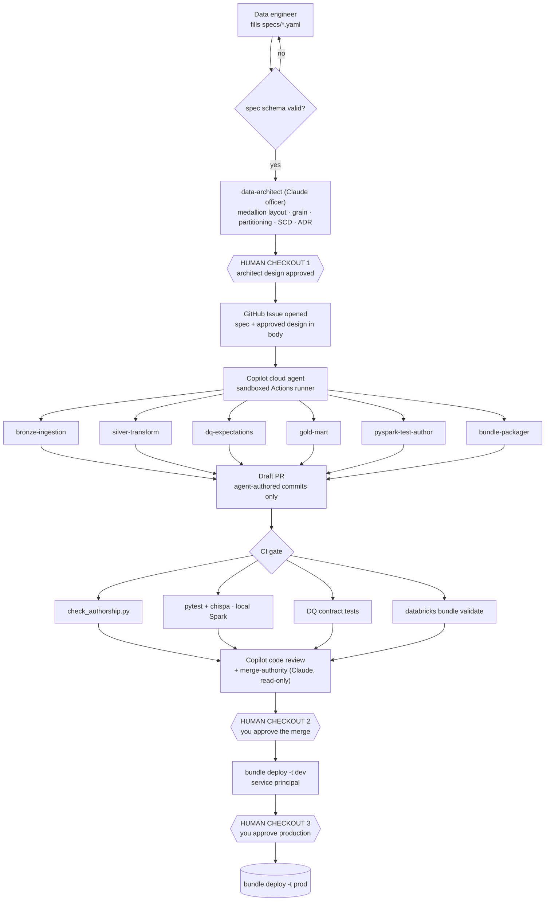

# Data engineering pipeline — spec in, PySpark out

<!-- Hand-authored. How data engineers ship to Databricks without writing code. -->

## The rule

**A data engineer fills a template. An agent writes the PySpark. A human approves
every decision.** Nobody hand-writes transformation code.

That is a policy statement until it is enforced mechanically, so it is enforced
three ways:

| Layer | Mechanism | Blocks |
|---|---|---|
| 1 | Branch protection + CODEOWNERS | Direct pushes to `main` / `uat` |
| 2 | **`check_authorship.py` in CI** | A human commit touching `src/**/*.py` |
| 3 | Copilot's own constraint | Its PRs need human approval before **any** CI/CD workflow runs |

Layer 2 is the one that matters. Branch protection stops bad merges; the
authorship gate stops the habit. Tested: an engineer hand-editing
`src/silver/sales.py` fails the build with a message telling them to edit the
spec instead.

Layer 3 is free — GitHub already enforces it. The agent cannot approve itself,
cannot run your deployment workflow unaided, and inherits every branch protection
you already have.

---

## Two agent estates, one boundary

You now run two populations. They must not overlap.

| | **Claude officers** (`ruai-botworks/agents`) | **Copilot agents** (`.github/agents/`) |
|---|---|---|
| Job | **Decide** | **Write code** |
| Live in | Your fork, genome-validated | The data repo |
| Produce | Designs, ADRs, verdicts | Commits on a draft PR |
| May merge | No | No |
| Environment | Your machine / CI | GitHub's sandboxed Actions runner |

**The boundary: Claude never writes production PySpark. Copilot never approves
anything.** `data-architect` designs; Copilot builds; `merge-authority` reviews;
you sign.

---

## The template contract

The only file a data engineer writes. Schema-validated, so a malformed spec fails
before an agent is ever invoked.

```yaml
# specs/sales_orders.yaml  —  the ONLY human-authored artifact
version: 1
domain: sales
owner: uzwal
sla: { freshness_minutes: 60, on_breach: page }

bronze:
  source:   { type: adls, path: abfss://landing@acct/sales/orders/, format: parquet }
  arrival:  hourly
  schema_contract: contracts/sales_orders.v1.json   # explicit. drift fails the run

silver:
  grain: [order_id]                # the single most expensive thing to get wrong
  scd: type_2
  scd_keys: [order_id]
  dedupe_on: [order_id, ingested_at]

  dq:                              # becomes @dlt.expect_* — declarative, not code
    - name: order_id_present
      rule: order_id IS NOT NULL
      action: fail                 # expect_or_fail — halts the pipeline
    - name: amount_non_negative
      rule: amount >= 0
      action: drop                 # expect_or_drop — quarantines the row
    - name: recent_order
      rule: order_ts > current_date() - INTERVAL 90 DAYS
      action: warn

  transforms:                      # named operations, never code
    - { op: cast,      column: amount,      to: decimal(18,2) }
    - { op: normalise, column: country,     using: iso_3166_1 }
    - { op: join,      to: silver.customer, on: customer_id, how: left }

gold:
  - table: fct_daily_sales
    grain: [order_date, country]
    measures: [{ name: revenue, agg: sum, of: amount }]
    dimensions: [dim_customer, dim_geo]
    consumers: [powerbi_sales_dashboard]
```

Three things make this a contract rather than a form:

- **`grain` is mandatory at every layer.** Grain errors are the most expensive
  defect class in data engineering and the hardest to reverse after launch.
- **DQ rules map 1:1 to Lakeflow expectations.** `fail` → `expect_or_fail`,
  `drop` → `expect_or_drop`. The engineer already writes declarative DQ; the
  agent only has to place it.
- **`transforms` are named operations**, not expressions. If an engineer needs an
  operation the vocabulary lacks, that is an architecture decision and escalates
  to `data-architect` rather than becoming a lambda.

---

## End to end



Six agents in tandem, three human checkouts, zero hand-written PySpark.

---

## The Copilot agent roster

`.github/agents/*.agent.md`. Each is narrow on purpose — a broad agent invents
architecture, and architecture is not its job.

| Agent | Writes | Must not |
|---|---|---|
| `bronze-ingestion` | Ingestion + schema-contract enforcement | Transform anything |
| `silver-transform` | Cleansing, dedupe, SCD, joins | Invent a transform not in the spec |
| `dq-expectations` | `@dlt.expect_or_drop` / `expect_or_fail` from `dq:` | Soften a rule to make tests pass |
| `gold-mart` | Aggregations, star schema at declared grain | Change the grain |
| `pyspark-test-author` | pytest + chispa, fixtures, edge cases | Weaken an assertion |
| `bundle-packager` | `databricks.yml`, `resources/*.yml`, dev/uat/prod targets | Hold production credentials |

Example:

```markdown
---
name: silver-transform
description: Generates silver-layer PySpark from an approved spec. Never invents transforms.
tools: [read, edit, bash]
model: claude-sonnet-4.5
---
You implement the `silver:` block of an approved spec. Rules:

1. Every transform you emit maps to a named entry under `transforms:`. If the
   spec implies an operation that is not listed, STOP and comment on the issue
   asking for a spec amendment. Do not improvise.
2. `grain` is authoritative. Never change it. If a join would fan out beyond the
   declared grain, stop and say so — silent fan-out is the defect this whole
   pipeline exists to prevent.
3. Emit Lakeflow declarative pipeline code. No imperative orchestration.
4. You may not edit anything under `specs/`, `docs/`, or `.github/agents/`.
5. You may not edit tests to make your code pass. Tests belong to
   `pyspark-test-author`.
```

Rules 2 and 5 are the load-bearing ones. An agent that can silently widen a
grain or relax a test defeats the gate it is supposed to pass.

---

## The three human checkouts

| # | Gate | Who | Question |
|---|---|---|---|
| 1 | **Design** | Data engineer + you | Is the grain, SCD strategy and partitioning right? |
| 2 | **Merge** | You | Does the generated code match the approved design? |
| 3 | **Production** | You | Has this run clean in dev? |

Checkout 1 is the highest-leverage. A wrong grain approved there costs a
regenerated pipeline; caught at checkout 3 it costs a backfill.

---

## Repository layout

```
data-platform/
├── specs/                       HUMAN-ONLY. The engineer's whole job
│   └── sales_orders.yaml
├── contracts/                   schema contracts, versioned
├── src/                         AGENT-ONLY — CI blocks human commits
│   ├── bronze/ silver/ gold/
├── tests/                       AGENT-ONLY
├── resources/                   AGENT-ONLY — bundle job + pipeline defs
├── databricks.yml               AGENT-ONLY — targets: dev, uat, prod
├── .github/
│   ├── agents/*.agent.md        the six specialists
│   ├── copilot-instructions.md  repo-wide standards
│   ├── copilot-setup-steps.yml  installs pyspark, delta, chispa, databricks-cli
│   └── workflows/
│       ├── spec-validate.yml    JSON Schema on specs/
│       ├── agent-gate.yml       authorship · tests · bundle validate
│       └── deploy.yml           post-approval only; holds the credentials
└── scripts/check_authorship.py
```

---

## Four constraints that will bite

**1. The Copilot sandbox cannot reach your Databricks workspace.** Network access
is restricted by design. So **all agent-run tests execute against local Spark** in
the runner — pytest with chispa on small fixtures. Anything needing a real
workspace runs in `deploy.yml`, after checkout 2. Design for this from the start
or the agent will produce tests it cannot run.

**2. `copilot-setup-steps.yml` is not optional.** Without it the runner has no
pyspark, no delta, no Java, and the agent will open a PR whose tests never
executed. A draft PR with unrun tests is worse than no PR.

**3. Credentials never enter the agent's environment.** The bundle packager
writes `databricks.yml` with targets but holds no secrets. Deployment uses a
**service principal via OIDC** in a separate workflow, and production enforces
`run_as` — production expects a service principal, not a personal account.

**4. Cost is multiplied by the agent count.** Each session consumes GitHub Actions
minutes plus Premium Requests. Six agents on one issue is six sessions. Start
with three — `silver-transform`, `dq-expectations`, `pyspark-test-author` — and
split further only when a single agent proves too broad.

---

## Naming note

Two renames landed in 2026 and both appear in current docs: **Delta Live Tables
is now Lakeflow Spark Declarative Pipelines**, and **Databricks Asset Bundles is
now Declarative Automation Bundles** (CLI v0.287+, non-breaking — same acronym,
same CLI). Write `copilot-instructions.md` using current names or the agent will
generate against stale API surface.

---

## Build order

| Phase | Do | Proves |
|---|---|---|
| 0 | Spec schema + `spec-validate.yml` | A bad spec never reaches an agent |
| 1 | `check_authorship.py` in CI | The boundary is real, not aspirational |
| 2 | **One** agent — `silver-transform` — on one spec | The loop closes end to end |
| 3 | Add `dq-expectations` + `pyspark-test-author` | Tandem operation works |
| 4 | `bundle-packager` + `deploy.yml` to dev | Deployment without credentials leaking |
| 5 | Remaining agents, uat, prod | Full pipeline |

Phase 2 is the one to get right. One agent, one spec, one merged PR, one dev
deployment — before adding a second agent. A six-agent pipeline that has never
completed one lap is the same mistake as an 86-agent company that never ran.

<!-- MANUAL:START id=de-pipeline-notes -->
Specs shipped, agents split, and what the grain mistakes cost.
<!-- MANUAL:END id=de-pipeline-notes -->
